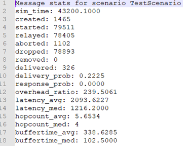

New routing algorithm implemented: DynamicTrustAndEncounterFrequencyRouting.java, in folder /routing

Proposed Method

	There exists many social parameters to measure the social relationship among nodes in a
network. We propose a method which uses the history of the encounters that particular node has
had and a dynamic trust based approach which is an indicator whether a particular node is further
forwards the packets it receives. These indicators are stored at each individual node for every
other node in the network. These two social relationship parameters are used in tandem to judge
which node the packet needs to be forwarded.

1. Encounters Times and Duration
	The number of encounters that a node has in the lifetime in the network can be stored
with the node identifier and is incremented each time it meets that node in the network. For a
more recency bias, the node only maintains a fixed number of previous encounters.This fixed
number could be decided based on the node movements and other real-time network traffic
conditions that exist in the network.This is done to eliminate a bias if two nodes have not met in
a long time the impact on the forwarding decision is minimised. After each node meets another
node in a network it increments its count for that node and the same operation is done for the
recipient node as well.
	To also increase the accuracy in the forwarding decision we have also maintained the
duration of the encounter in milliseconds with each node. By using both these parameters we
could determine which particular node has a stronger relationship with the sender node and
forward that packet to it.

2. Dynamic Trust
	The above method has its fair share of issues and drawbacks and cannot be used in a real-world opportunistic network. The above method only accounts for the proximity and closeness that a particular node has with its immediate sender or next hop and does not account whether the particular node can deliver its packet to the destination. Hence to account for this factor we are using the trust value for each node that a node has based on whether he delivered the packet to the destination node. This trust value cannot be static for each node and has to be updated based on the history of the node’s delivery ratio for that node. This mapping is also stored at each node and will be useful in taking the decision of forwarding the packet to the next hop node.

2.1	Two-Hop Feedback Method
	We have implemented the two-hop feedback trust based approach to quantitatively figure out an appropriate node to forward the packet. This approach requires two hops away intermediate nodes to form an acknowledgement message for a node and send it back which will increment the neighbouring node’s trust value. Thus senders do not have to wait for receiving the final acknowledgement from the receiver. In Figure 1, node S sends a message to node i, now node i buffers this message and looks for eligible neighbours to pass on this message. Based on the previous trust value and encounter times, it decides to forward the message to node k. Node k after receiving this message sends an acknowledgement back to node S(source node) containing the message of the intermediate node i’s identifier. After node S receives this acknowledgement, it increments the trust value for node i. This acknowledgement has a short duration timestamp, after this timestamp, the ack is dropped. If the message is received within this duration, node S increases the trust value for node i. The model for sending the acknowledgement could be flooding or a single forward message. Similarly, the trust value for node k is incremented at node i after node j sends an acknowledgement. This method is used to calculate the trust value for neighbouring nodes. This is helpful if a selfish node exists in the system or there is congestion at a particular node, the trust value of that node would decrease for its neighbours.
	
	
2.2 Destination Based Trust
	Apart from the neighbouring trust value, we are also evaluating the number of hops it took to reach the destination node. After reaching the destination node, when the receiver sends back the acknowledgement message, it contains the list of the hops it went through during the path followed. The more the length of the path to reach the destination the lesser the increase in the value for that node. After reaching the destination, the receiver sends an acknowledgement back to the sender to delete the message from its uffer. At this time it also sends back the list of the hopes it took to reach the destination. After reaching the source node, it updates the trust value of all the intermediate nodes in the list of hops by a value that is inversely proportional to the hop length. This discourages our routing algorithm from taking a path with a higher hop count.

Simulation
We have implemented our routing protocol in the Opportunistic Network Environment simulator (ONE) [9]. We have taken a fixed setting of 100 nodes in the network with all nodes following the “Shortest Path Movement Model”. We compared our routing algorithm to the existing PRoPHET Routing algorithm and were able to obtain better results in almost all parameters including the delivery probability and the lesser overhead. In Figure 2 and 3 show the Message stats for our routing algorithm and the PRoPHET algorithm respectively, we can see the comparison between the results we observed.
For our implementation of the given scenario we have given equal weightage to both the trust and encounter times factors in the formula while deciding the next hop node. These constants could vary based on the network state and the application requirements. By adjusting these factors, we can achieve a good trade off between the delivery probability and the average latency observed for a packet that travels in the network.

Simulation of proposed method

Simulation of PRoPHET

Steps to follow to run simulation:

1) First run the command compile.bat in the root folder of the saved Repo.

2) Run the command one.bat -b 4 SimulationResults/settings.txt, to run the simulation 4 times. The number of rounds could be variable depending on the need.

3) Check the simulation results in the folder \SimulationResults\DynamicTrustAndEncounterFrequencyRouting\reports